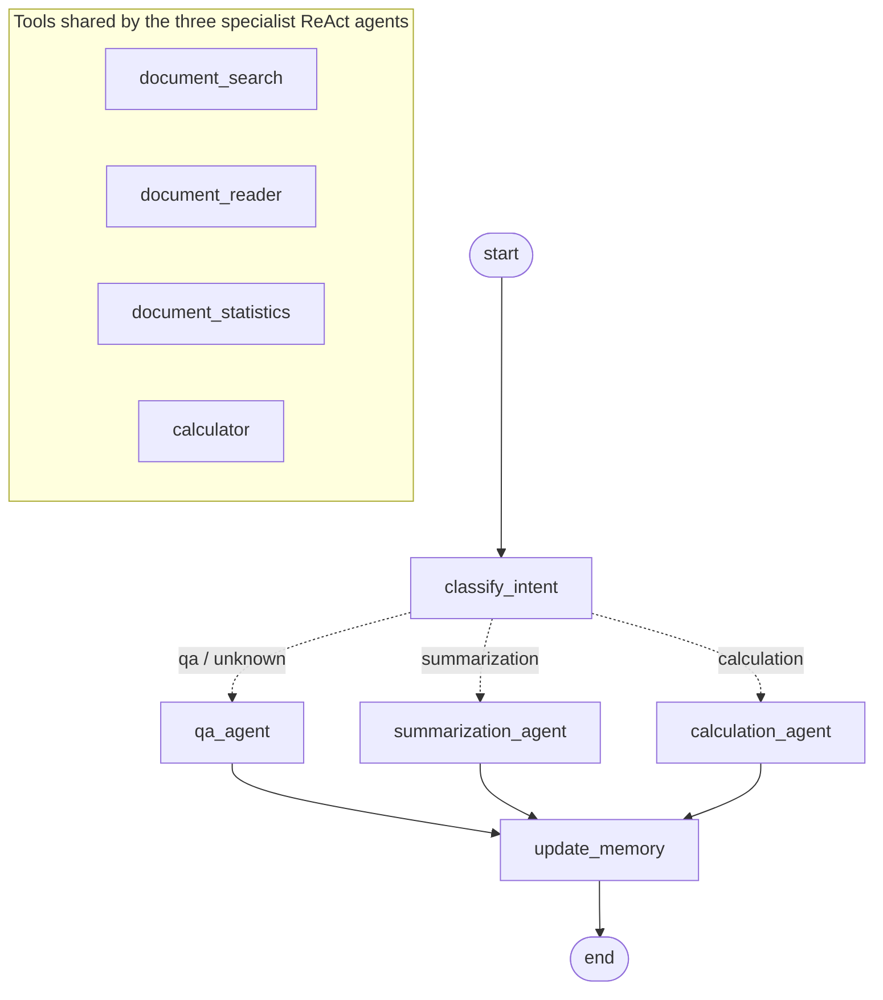

# DocDacity Document Assistant

A multi-agent document assistant built with **LangChain** and **LangGraph**. It answers
questions about, summarizes, and calculates over a small set of financial and healthcare
documents (invoices, a service agreement, an insurance claim).

Each user message is classified by an intent router and handed to one of three
specialist ReAct agents (Q&A, summarization, calculation), each with its own tools and
Pydantic response schema. A memory node then summarizes the conversation and tracks
which documents are in play. State persists across turns through a LangGraph
checkpointer, and across restarts through session files.

> Udacity *Agentic AI Engineer with LangChain and LangGraph*, Project: Report-Building Agent
> (Document Assistant). The original task list is kept in
> [docs/PROJECT_INSTRUCTIONS.md](docs/PROJECT_INSTRUCTIONS.md).

**At a glance**

- All tasks (1.1 to 4.1) are implemented. See the [rubric map](#rubric-map) at the end.
- There are **93 offline tests**, which need no API key and use a scripted chat model to
  drive the real graph. There are also **14 live tests**, including a 13-case labelled
  intent set: the classifier scores 13 of 13, and a four-turn end-to-end run passes.
- [docs/example_conversations.md](docs/example_conversations.md) is a real nine-turn transcript,
  covering every intent, follow-ups resolved from memory, and memory surviving a restart.
  The files it produced are committed in [`sessions/`](sessions) and [`logs/`](logs).
- Five defects in the starter code were found and fixed; each is described
  [below](#defects-found-in-the-starter-and-fixed).

---

## Quick start

```bash
python -m venv .venv
.venv\Scripts\activate            # macOS/Linux: source .venv/bin/activate
pip install -r requirements.txt
cp .env.example .env              # then put your key in .env
python main.py
```

`.env` settings:

| Variable | Default | Notes |
|---|---|---|
| `OPENAI_API_KEY` | (required) | A Udacity `voc-...` key or an OpenAI key |
| `OPENAI_BASE_URL` | `https://openai.vocareum.com/v1` | Set `https://api.openai.com/v1` for a direct OpenAI key |
| `MODEL_NAME` | `gpt-4o` | |
| `TEMPERATURE` | `0.1` | |
| `SESSION_STORAGE_PATH` | `./sessions` | |

In the CLI, `/docs` lists the documents, `/sessions` lists saved sessions, `/help` shows
the example queries and `/quit` exits. To resume a session, enter its ID at the
second startup prompt.

Each answer is followed by the routing decision and its reasoning, the key structured
fields, the path the turn took through the graph, the sources, the tools called, and
the running memory summary:

```text
Enter Message: What is 15% of the INV-003 total?

🤖 Assistant: 15% of the total from invoice INV-003 is 32,175 USD.
I calculated this by taking the total amount due, which is 214,500 USD, and multiplying it by 0.15.

INTENT: calculation (confidence 0.95)
REASONING: The request involves computing 15% of a total, which requires arithmetic beyond
simply reading a number from the document.
CALCULATION: 214500 * 0.15 = 32,175.00 USD
GRAPH PATH: classify_intent -> calculation_agent -> update_memory
SOURCES: INV-003
TOOLS USED: document_reader, calculator
CONVERSATION SUMMARY: The user asked for the calculation of 15% of the total amount from
invoice INV-003. The total amount due on INV-003 is $214,500, and 15% of this amount is $32,175.
```

Other entry points:

```bash
python -m pytest                                   # 93 offline tests, about 5 s, no API key
RUN_LIVE=1 python -m pytest tests/test_live.py     # 14 live tests against the model
python scripts/run_demo.py                         # regenerate docs/example_conversations.md
```

On Windows PowerShell, set the variable first: `$env:RUN_LIVE=1; python -m pytest tests/test_live.py`.

---

## Architecture



The diagram matches `create_workflow(...).get_graph()`, and the tests assert every edge.
The course's own diagram is in [docs/langgraph_agent_architecture.png](docs/langgraph_agent_architecture.png).

| Node | Model call | Output schema | Writes to state |
|---|---|---|---|
| `classify_intent` | `llm.with_structured_output(UserIntent)` | `UserIntent` | `intent`, `next_step`, `actions_taken` |
| `qa_agent` | ReAct agent with tools, `QA_SYSTEM_PROMPT` | `AnswerResponse` | `messages`, `current_response`, `tools_used`, `next_step`, `actions_taken` |
| `summarization_agent` | ReAct agent with tools, `SUMMARIZATION_SYSTEM_PROMPT` | `SummarizationResponse` | (same as above) |
| `calculation_agent` | ReAct agent with tools, `CALCULATION_SYSTEM_PROMPT` | `CalculationResponse` | (same as above) |
| `update_memory` | `llm.with_structured_output(UpdateMemoryResponse)` | `UpdateMemoryResponse` | `conversation_summary`, `active_documents`, `next_step`, `actions_taken` |

The graph is compiled once. The LLM, the tools and the thread ID all arrive per call in
`config["configurable"]`, so nodes never close over a particular model. That is what lets
the tests run the same compiled graph with a scripted model.

---

## Implementation, task by task

### 1. Schemas ([src/schemas.py](src/schemas.py))

**Task 1.1: `AnswerResponse`**

| Field | Type | Default | Constraint |
|---|---|---|---|
| `question` | `str` | required | |
| `answer` | `str` | required | |
| `sources` | `List[str]` | `[]` (`default_factory=list`) | IDs normalised: stripped, upper-cased, de-duplicated |
| `confidence` | `float` | `0.5` | `ge=0.0, le=1.0` |
| `timestamp` | `datetime` | `datetime.now` | |

**Task 1.2: `UserIntent`**

| Field | Type | Constraint |
|---|---|---|
| `intent_type` | `Literal["qa", "summarization", "calculation", "unknown"]` | Anything else fails validation; `" QA "` is normalised to `"qa"` first |
| `confidence` | `float` | `ge=0.0, le=1.0` |
| `reasoning` | `str` | required |

The constraints are real Pydantic validation, not documentation.
`AnswerResponse(confidence=1.5)` and `UserIntent(intent_type="search")` both raise
`ValidationError`. They also reach the model: `ge`/`le` become `minimum`/`maximum` and the
`Literal` becomes an `enum` in the JSON schema sent to OpenAI. `tests/test_schemas.py` checks
the types, the defaults, both bounds, the enum and the generated schema.

### 2. Agent state and the graph ([src/agent.py](src/agent.py), [src/assistant.py](src/assistant.py))

**Task 2.2: `classify_intent`.** The node calls `llm.with_structured_output(UserIntent)` with
`get_intent_classification_prompt().format(user_input=..., conversation_history=...)`.
The history is rendered by `format_conversation_history`: the last 8 user and assistant
turns, plus the running summary, with tool traffic left out because it is noise for a
routing decision. The routing table is the dictionary `INTENT_TO_NODE`, and anything else
(including `unknown`) goes to `qa_agent`. If the classifier call itself fails, the turn
falls back to the Q&A agent instead of crashing. The node returns
`actions_taken=["classify_intent"]`, `intent` and `next_step`.

**Task 2.3: the specialist agents.** `qa_agent`, `summarization_agent` and `calculation_agent`
follow the pattern of the provided `qa_agent`: build the intent's chat prompt, call
`invoke_react_agent` with the intent's schema, and return the same five state keys. The
shared body lives in one helper, `_run_specialist(intent, schema, node_name, ...)`, so
the three nodes cannot drift apart. Each node is one readable line naming its prompt,
schema and action.

**Task 2.4: `update_memory`.** The signature became `update_memory(state, config)` so the node
can read the LLM from `config["configurable"]`. It uses `with_structured_output(UpdateMemoryResponse)`,
writes `conversation_summary` and `active_documents`, and sets `next_step="end"`.
If the memory model returns no document IDs, it falls back to the IDs the specialist
cited, then to the documents already in play.

**Task 2.5: `create_workflow`.** The function adds the five nodes, maps the three routes in
`add_conditional_edges`, connects each specialist to `update_memory`, connects
`update_memory` to `END`, and compiles with a checkpointer.

**Task 2.6: persistence.** `actions_taken: Annotated[List[str], operator.add]`;
`workflow.compile(checkpointer=InMemorySaver())`; and `process_message` sets `thread_id`
(the session ID), `llm` and `tools` in `config["configurable"]`.

### 3. Prompts ([src/prompts.py](src/prompts.py))

**Task 3.1: `get_chat_prompt_template`.** The function maps `qa`, `summarization` and
`calculation` to their system prompts, and anything else to the Q&A prompt, which
matches the router's default. It returns `ChatPromptTemplate[system, MessagesPlaceholder("chat_history"), human]`.

**Task 3.2: `CALCULATION_SYSTEM_PROMPT`.** The prompt is a five-step procedure:
1. Identify the documents: use the ID if one was named, otherwise `document_search`.
2. Read every source with `document_reader`, never from search previews.
3. Build a plain-number expression: no `$`, no commas, and only the allowed operators.
4. Call the calculator, which is **mandatory for ALL arithmetic, no matter how simple**.
5. Report the result, the expression, the source IDs and the units.

It also says what to do when a figure is missing and when the calculator rejects an
expression. In the demo, the model called the calculator even for `15000 * 18`.

**The intent classification prompt** was rewritten, keeping its two input variables,
because the rubric asks for *clear categories, examples, and instructions for confidence
scoring and reasoning*. The starter prompt had none of the last three. The new prompt has:
- a precise definition of each of the four categories, including the qa/calculation
  boundary ("a number already written down" versus "a number that must be computed");
- ten worked examples covering every category, including borderline cases such as
  "Which documents are over $50,000?", which is a filtered lookup and so `qa`;
- rules for follow-ups ("And for INV-003?" keeps the previous intent) and for mixed
  requests (anything that needs arithmetic is `calculation`);
- a four-band confidence rubric (0.90-1.00, 0.70-0.89, 0.40-0.69, below 0.40, meaning prefer
  `unknown`) and a one-to-two-sentence reasoning requirement.

On the 13-case labelled set in `tests/test_live.py`, the classifier scores 13 of 13.

### 4. Calculator tool ([src/tools.py](src/tools.py))

**Task 4.1.** `create_calculator_tool(logger)` returns a `@tool`-decorated `calculator(expression: str) -> str`.
It uses `eval()` as the task requires, but only after the expression passes four layers of validation:

1. **Normalise.** Strip `$`, turn thousands separators such as `20,000` into `20000`, and
   map `×`/`÷` to `*`/`/`, because the model copies figures straight out of documents.
2. **Character allow-list.** Only digits, `+ - * / % ( ) .` and whitespace are allowed.
   Letters, underscores, quotes and brackets are rejected at this stage.
3. **AST allow-list.** After `ast.parse`, only `BinOp`, `UnaryOp`, numeric `Constant` and
   the arithmetic operators are allowed. No `Name`, `Call`, `Attribute`, `Subscript`,
   `Compare` or anything else.
4. **Resource limits.** Expressions are capped at 200 characters, exponents must be plain
   numbers no larger than 100 (which stops `9 ** 9 ** 9`), and results must be finite and
   no larger than 1e30.

Only then does it run `eval(expr, {"__builtins__": {}}, {})`. The result is **always a
string**, as the rubric specifies: `"5"` rather than `5` or `"5.0"`, `"2.5"`, and
`"0.3333333333"` (up to 10 decimal places). Every failure path (division by zero, bad
syntax, a disallowed operation) returns a message starting with `Error:` rather than
raising, so a bad expression never breaks the agent loop, and the model can read the
message and retry. Every call is logged, success or failure, through `ToolLogger`.
`tests/test_calculator.py` has 12 evaluation cases and 15 attack or invalid cases,
including `__import__('os')`, `().__class__`, `True + 1` and the exponent bomb.

---

## How state and memory work

Memory has three layers, each with a different lifetime.

**1. Within a turn: the `AgentState` channels.** Each node returns a partial update, and
LangGraph merges it using each channel's reducer:

| Channel | Reducer | Behaviour |
|---|---|---|
| `messages` | `add_messages` | Appends new messages; a message with an existing ID replaces it instead of duplicating |
| `actions_taken` | `operator.add` | Every node returns `["<its name>"]`, and the lists are concatenated |
| everything else | last value wins | `intent`, `next_step`, `current_response`, `tools_used`, `conversation_summary`, `active_documents` |

**2. Across turns: the `InMemorySaver` checkpointer.** `process_message` invokes the graph
with `thread_id = session_id`. After every node, the checkpointer saves the full state
under that thread, and the next `invoke` on the same thread starts from it. That is why
each turn passes `messages: []`: `add_messages` appends nothing, and the history is
already in the checkpoint. The specialist prompt receives the whole history through
`MessagesPlaceholder("chat_history")`. That is how the demo's
"What is the average of those?" knows that "those" means the three invoice totals from the
previous turn, with no tool call at all.

Two consequences had to be handled deliberately:

- **`actions_taken` accumulates for the whole session, not per turn.** Passing `[]` in the
  input adds nothing, so it cannot reset an `operator.add` channel. `process_message` reads
  the list's length from the checkpoint before invoking and slices the new entries off
  afterwards. The response reports both `actions_taken` (this turn, e.g.
  `classify_intent -> calculation_agent -> update_memory`) and `all_actions_taken` (the whole thread).
  `test_state_persists_across_turns_via_checkpointer` checks both.
- **A ReAct result repeats the entire history.** Anything counted per turn (`tools_used`,
  the measured `original_length`) is taken from `current_turn_messages()`, which is the
  messages after the last human message. The system prompt is also removed before the
  messages go back into state; otherwise `add_messages` would give it a new ID each turn
  and stack one more system prompt into the history every time.

**3. Across restarts: session files.** `InMemorySaver` is in-process only. After every
turn, `DocumentAssistant` writes `sessions/<session_id>.json`: a JSON-safe record per turn
holding the input, the intent, this turn's path, the tools, the answer, the structured
response, the active documents and the summary. When a session ID is entered at startup,
`_restore_graph_state()` rebuilds the thread with `workflow.update_state(..., as_node="update_memory")`,
seeding the messages, summary and active documents. Turn 9 of the demo runs in a
brand-new assistant with an empty checkpointer and still answers "which claim did we just
look at?" correctly.

**Summary and active documents.** `update_memory` asks the model for an
`UpdateMemoryResponse(summary, document_ids)` after every turn. The summary feeds the
next turn's intent classifier, as "Summary of earlier conversation: ...", and is shown
in the CLI. `active_documents` is the working set of document IDs; for example, turn 7
of the demo leaves `CLM-001` active for the turn-9 follow-up.

**Tool logs.** `ToolLogger.set_session(id)` points the shared logger at
`logs/session_<id>.json`, so each session has its own tool-call history, and a resumed
session appends to its existing log. Each entry has a timestamp, the tool name, the
exact input and the output or error.

---

## How structured outputs are enforced

Every model call except the ReAct tool loop returns a Pydantic object:

| Where | Mechanism | Schema |
|---|---|---|
| Intent router | `llm.with_structured_output(UserIntent)` | `UserIntent` |
| Q&A / summarization / calculation | `create_react_agent(..., response_format=(prompt, Schema))`: after the tool loop finishes, LangGraph makes one more `with_structured_output(Schema)` call | `AnswerResponse` / `SummarizationResponse` / `CalculationResponse` |
| Memory | `llm.with_structured_output(UpdateMemoryResponse)` | `UpdateMemoryResponse` |

With `langchain-openai`, `with_structured_output` uses OpenAI's native JSON-schema mode,
so the constraints are applied twice. The model is constrained by the JSON schema
(`enum`, `minimum`/`maximum`), and the reply is then validated by Pydantic (types,
bounds, the `Literal`, and the ID-normalising validators). A reply that fails validation
raises an error instead of flowing on as a malformed dict.

Three robustness measures were added after reading real transcripts:

1. **The structured response is pinned to the current turn.** LangGraph builds the
   structured response from the *whole* message list. The first demo run showed the
   model filling `AnswerResponse` with the session's *first* question in four of nine turns;
   for example, "Hi! What can you do?" came back as `question: "What's the total amount
   due on invoice INV-002?"`. A generic "describe the latest message" instruction fixed only
   half of them. The fix that holds is `get_structured_response_prompt(question)`, which puts
   the current question into the instruction verbatim. It is passed as
   `response_format=(prompt, Schema)`, and all nine demo turns now describe their own turn.
2. **Values the model cannot know are measured by the code.** The model invented timestamps
   (`2023-10-06T14:30:00Z`) and guessed summary lengths (a round `1000`). `_structured()`
   overwrites `timestamp` with the real time, and `original_length` with the character count
   of the documents actually read that turn.
3. **Graceful degradation.** If a classifier, specialist or memory call fails, the turn still
   completes with a readable message, and the previous memory is kept.

Structured responses are stored as JSON-safe dicts in `current_response`, returned by
`process_message` as `structured_response`, printed in the CLI (confidence, the calculation,
the number of key points), and saved in each turn record in the session file.

---

## Defects found in the starter and fixed

| # | Where | Defect | Effect | Fix |
|---|---|---|---|---|
| 1 | `assistant.py` `_save_session` | Appended raw graph state (LangChain message objects, Pydantic models) to `conversation_history`, and dumped it with a `default` hook that returns non-datetimes unchanged | `json.dump` raises on the first turn, so `process_message` reports failure even though the graph succeeded | A JSON-safe per-turn record, and `model_dump(mode="json")` |
| 2 | `schemas.py` | `default_factory=lambda: dict` and `lambda: list` return the *type*, not an empty instance | `DocumentChunk().metadata` is the class `dict` | `default_factory=dict` / `list` |
| 3 | `tools.py` `document_search` | `if search_type == "all": ... if search_type == "keyword": ... else:` | `"all"` falls through to the `else` branch and is overwritten | `elif` |
| 4 | `tools.py` `document_search` | The keyword branch ignored `comparison`/`amount` | "Documents over $50,000" returned 1 of the 3 matches (seen in a live run) | Amount criteria take precedence |
| 5 | `prompts.py`, `tools.py` | `from langchain.prompts import ...` / `from langchain.tools import tool` | `ModuleNotFoundError` on langchain 1.x, which is what `pip install -r requirements.txt` installs today | Import from `langchain_core` (works on 0.3 and 1.x) |

Smaller fixes: `main.py` printed `result["active_documents"]` but `process_message`
returned only `sources`, so SOURCES never appeared (both keys are now returned); `main.py`
ignored `MODEL_NAME`/`TEMPERATURE` from `.env`; the emoji in the CLI crashed Windows
cp1252 consoles; and `_get_conversation_summary` defaulted to `[]` instead of a string.
Each defect has a regression test.

---

## Testing

```text
tests/test_schemas.py      Task 1: fields, types, defaults, bounds, enum, JSON schema
tests/test_calculator.py   Task 4: results as strings, 15 attack/invalid inputs, logging, search fixes
tests/test_prompts.py      Task 3: prompt selection, prompt structure, calculation and intent prompt content
tests/test_workflow.py     Task 2: nodes and edges, checkpointer, reducer, routing for all 4 intents,
                           tool execution, persistence across turns, thread isolation, fallbacks,
                           structured-response pinning, measured fields
tests/test_assistant.py    process_message end to end, session file, per-session tool log,
                           resume after restart
tests/test_live.py         (RUN_LIVE=1) 13 labelled intents + a 4-turn real conversation
```

The offline tests drive the **real** compiled graph, the real `create_react_agent` and the
real tools with `ScriptedChatModel` (in [tests/conftest.py](tests/conftest.py)). This is a
`BaseChatModel` that replays scripted replies, including tool calls, which makes the ReAct
agent execute the real calculator. It returns scripted Pydantic objects from
`with_structured_output`, and records every prompt it receives so the tests can check
what each node sent.

Results on the tested stack (Python 3.11; langgraph 1.2.12, langchain-core 1.6.5,
langchain-openai 1.6.6; exact versions in `requirements-lock.txt`):

```text
python -m pytest                             93 passed, 14 skipped
RUN_LIVE=1 python -m pytest tests/test_live.py   14 passed
```

---

## Example conversations

The full transcript, with every turn's intent, reasoning, graph path, tools, memory
summary and structured response, is in
**[docs/example_conversations.md](docs/example_conversations.md)**. It was generated by
`scripts/run_demo.py` against `gpt-4o`. The files it produced are
[`sessions/477cd3a5-….json`](sessions) and [`logs/session_477cd3a5-….json`](logs),
which record 12 tool calls: 5 `document_reader`, 3 `document_search`, 3 `calculator`
and 1 `document_statistics`.

| # | Feature shown | User | Route | Tools | Result |
|---|---|---|---|---|---|
| 1 | Q&A with citation | What's the total amount due on invoice INV-002? | qa | document_reader | $69,300, source INV-002 |
| 2 | Q&A over a filtered search | Find documents with amounts over $50,000 | qa | document_search | INV-003, CON-001, INV-002 |
| 3 | Cross-document calculation | Calculate the sum of all invoice totals | calculation | search, statistics, reader ×2, **calculator** | `69300 + 214500 + 22000` = **$305,800** (INV-001 has no "total" line, so it was derived as $20,000 + $2,000 tax) |
| 4 | Follow-up from memory | What is the average of those? | calculation | **calculator** only | `305800 / 3` = $101,933.33, with no documents re-read |
| 5 | Summarization | Summarize the service agreement | summarization | reader | Summary + 7 key points, CON-001 |
| 6 | Follow-up on a summary | What would it cost if it ran for 18 months instead? | calculation | **calculator** only | `15000 * 18` = $270,000 |
| 7 | Healthcare summary | Give me the key points of the insurance claim | summarization | search, reader | 8 key points; CLM-001, $2,450, under review |
| 8 | Unknown intent | Hi! What can you do? | unknown → qa | none | Capability overview |
| 9 | Memory after restart | Remind me which claim we just looked at, and who the claimant is. | qa | none | "CLM-001 … John Doe", answered by a new process from the restored session |

Excerpt from turn 4, where memory resolves "those":

```text
User:       What is the average of those?
Intent:     calculation (0.90): "...the average of the amounts from the previously identified
            documents, which requires arithmetic to compute the mean value."
Graph path: classify_intent -> calculation_agent -> update_memory
Tools used: calculator
Structured: {"expression": "305800 / 3", "result": 101933.33, "units": "USD", ...}
```

---

## Project structure

```text
document-assistant/
├── src/
│   ├── schemas.py        # Pydantic models: AnswerResponse, UserIntent, ... (Task 1)
│   ├── agent.py          # AgentState, the nodes, create_workflow (Task 2)
│   ├── assistant.py      # DocumentAssistant: config, sessions, restore (Task 2.6)
│   ├── prompts.py        # Intent, chat and calculation prompts (Task 3)
│   ├── tools.py          # Calculator (Task 4), search, reader, statistics, ToolLogger
│   └── retrieval.py      # Simulated keyword/amount retriever over 5 sample documents
├── tests/                # 93 offline tests + 14 live tests
├── scripts/run_demo.py   # Generates docs/example_conversations.md
├── docs/
│   ├── example_conversations.md
│   ├── PROJECT_INSTRUCTIONS.md
│   └── langgraph_agent_architecture.png
├── sessions/             # Auto-generated: one JSON file per session
├── logs/                 # Auto-generated: one tool-call log per session
├── main.py               # Interactive CLI
├── requirements.txt      # Compatible ranges
└── requirements-lock.txt # The exact versions tested
```

---

## Rubric map

| Rubric criterion | Where it is met | Evidence |
|---|---|---|
| Structured output schemas with required fields, types and defaults | `src/schemas.py` `AnswerResponse`, `UserIntent` | `tests/test_schemas.py` |
| Auto-generated logs directory with tool-call history per session | `ToolLogger.set_session`, `logs/session_<id>.json` | [`logs/`](logs), `test_tool_calls_logged_per_session` |
| Auto-generated sessions directory with history of sessions | `DocumentAssistant._save_session`, `sessions/<id>.json` | [`sessions/`](sessions), `test_session_file_is_valid_json_with_turn_records` |
| Type enforcement: confidence 0-1, intent restricted | `Field(ge=0, le=1)`, `Literal[...]` | `test_confidence_out_of_range_rejected`, `test_invalid_intents_rejected` |
| Complete workflow: StateGraph, nodes, conditional edges, compiled | `create_workflow` | `test_graph_has_all_nodes_and_edges`, `test_compiled_with_in_memory_checkpointer` |
| Correct routing and state flow | `classify_intent`, `should_continue`, edges | `test_routes_each_intent_to_its_agent` (all 4 intents), live intent set 13/13 |
| Calculator: `@tool`, safety validation, eval, logging, errors, returns a string | `create_calculator_tool` | `tests/test_calculator.py` |
| Intent prompt: categories, examples, confidence and reasoning instructions | `get_intent_classification_prompt` | `test_intent_prompt_has_categories_examples_and_scoring` |
| Dynamic chat prompt selection | `get_chat_prompt_template` | `test_chat_prompt_selects_system_prompt` |
| End to end across all intents with tools, memory and responses | the whole system | `docs/example_conversations.md`, `test_end_to_end_all_intents` |
| Documentation: decisions, state and memory, structured outputs, examples | this README | the sections above |
